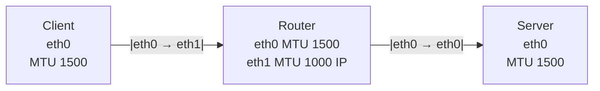

# Scenario 1, MTU on ingress eth1

## Testing
```
pawel@worker-1:~$ ping -M do -s 1472 10.171.176.130
PING 10.171.176.130 (10.171.176.130) 1472(1500) bytes of data.
1480 bytes from 10.171.176.130: icmp_seq=1 ttl=63 time=0.675 ms
1480 bytes from 10.171.176.130: icmp_seq=2 ttl=63 time=0.603 ms
```
As we can see, the packet with payload of 1472 (+32 ICMP and IP overhead) is still allowed through despite MTU set to 1000 on eth1 (ingress of the Router)
