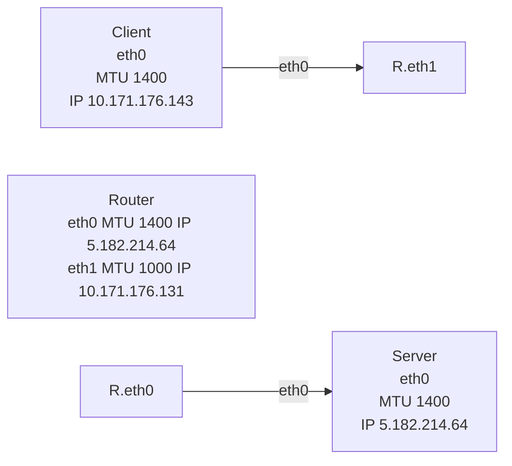

#

```mermaid
graph LR
    C["Client<br/>eth0<br/>MTU 1400<br/>IP 10.171.176.143"]

    R["Router<br/>eth0 MTU 1400 IP 5.182.214.64<br/>eth1 MTU 1000 IP 10.171.176.131"]

    S["Server<br/>eth0<br/>MTU 1400<br/>IP 5.182.214.64"]

    C -- eth0 --> R.eth1
    R.eth0 -- eth0 --> S


```
