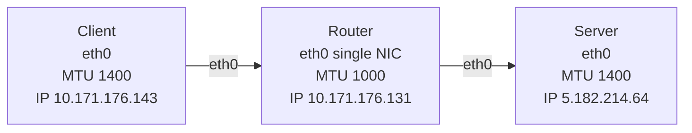

#

```mermaid
graph LR
    C["Client<br/>eth0<br/>MTU 1400<br/>IP 10.171.176.143"]
    R["Router<br/>eth0 single NIC<br/>MTU 1000<br/>IP 10.171.176.131"]
    S["Server<br/>eth0<br/>MTU 1400<br/>IP 5.182.214.64"]

    C -- eth0 --> R
    R -- eth0 --> S

```
