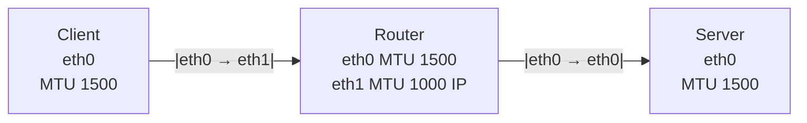

# Scenario 1: MTU on ingress eth1

## MTU Discovery
Let's do MTU discovery from the client to the server. The lower MTU is set on the ingress interface of the router from the client's perspective.

### MTU Discovery from the client

```
pawel@worker-1:~$ ping -M do -s 1472 10.171.176.130
PING 10.171.176.130 (10.171.176.130) 1472(1500) bytes of data.
1480 bytes from 10.171.176.130: icmp_seq=1 ttl=63 time=0.675 ms
1480 bytes from 10.171.176.130: icmp_seq=2 ttl=63 time=0.603 ms
```
As we can see, the packet with payload of 1472 (+32 ICMP and IP overhead) is still allowed through despite MTU set to 1000 on eth1 (ingress of the Router)

On router, we can observe that we will accept packets with size of 1472 but the response is with length of MTU of eth1 (1000-24=976):
```
root@router-1:~# tcpdump -iany -n -nn icmp and host 10.1.1.20
tcpdump: data link type LINUX_SLL2
tcpdump: verbose output suppressed, use -v[v]... for full protocol decode
listening on any, link-type LINUX_SLL2 (Linux cooked v2), snapshot length 262144 bytes
09:51:20.514954 ens33 In  IP 10.1.1.20 > 10.171.176.130: ICMP echo request, id 58085, seq 18, length 1480
09:51:20.514973 ens32 Out IP 10.1.1.20 > 10.171.176.130: ICMP echo request, id 58085, seq 18, length 1480
09:51:20.515464 ens32 In  IP 10.171.176.130 > 10.1.1.20: ICMP echo reply, id 58085, seq 18, length 976
09:51:20.515464 ens32 In  IP 10.171.176.130 > 10.1.1.20: ip-proto-1
09:51:20.515485 ens33 Out IP 10.171.176.130 > 10.1.1.20: ICMP echo reply, id 58085, seq 18, length 976
09:51:20.515493 ens33 Out IP 10.171.176.130 > 10.1.1.20: ip-proto-1
```

### MTU Discovery from the server
On the server:
```
pawel@loadbalancer:~$ ping -M do -s 1400 10.1.1.21
PING 10.1.1.21 (10.1.1.21) 1400(1428) bytes of data.
From 10.171.176.131 icmp_seq=1 Frag needed and DF set (mtu = 1000)
ping: local error: message too long, mtu=1000
ping: local error: message too long, mtu=1000
ping: local error: message too long, mtu=1000
ping: local error: message too long, mtu=1000
```
As we can see, the ping didn't go through and we got the message indicating about too large MTU. 
Tcpdump shows that we got the ICMP unreachable from the router:
```
pawel@loadbalancer:~$ sudo tcpdump -iany -n -nn host 10.171.176.130 or host 10.171.176.131 or host 10.1.1.21 and not port 22 and not port 6443 | grep -v ARP
tcpdump: data link type LINUX_SLL2
tcpdump: verbose output suppressed, use -v[v]... for full protocol decode
listening on any, link-type LINUX_SLL2 (Linux cooked v2), snapshot length 262144 bytes


12:15:41.607522 ens192 Out IP 10.171.176.130 > 10.1.1.21: ICMP echo request, id 63774, seq 1, length 1408
12:15:41.607813 ens192 In  IP 10.171.176.131 > 10.171.176.130: ICMP 10.1.1.21 unreachable - need to frag (mtu 1000), length 556
12:16:37.965051 ens192 Out IP 10.171.176.130 > 10.1.1.21: ICMP echo request, id 63778, seq 1, length 1408
12:16:37.965364 ens192 In  IP 10.171.176.131 > 10.171.176.130: ICMP 10.1.1.21 unreachable - need to frag (mtu 1000), length 556
```

tcpdump on the router:
```

12:27:56.136534 ens32 In  IP 10.171.176.130 > 10.1.1.21: ICMP echo request, id 63799, seq 1, length 1408
12:27:56.136568 ens32 Out IP 10.171.176.131 > 10.171.176.130: ICMP 10.1.1.21 unreachable - need to frag (mtu 1000), length 556
```

### Note
The most common misconception is that the MTU is set on ingress and egress. As we can see the MTU is applied only on the egress.
