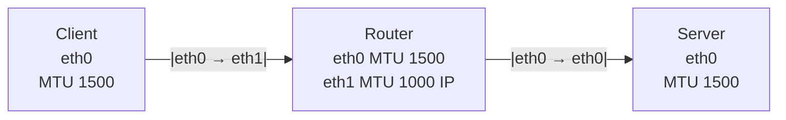

# Scenario 1: MTU on ingress eth1

## MTU Discovery
Let's do MTU discovery from the client to the server. The lower MTU is set on the ingress interface of the router from the client's perspective.

### MTU Discovery from the client

```
pawel@worker-1:~$ ping -M do -s 1472 10.171.176.130
PING 10.171.176.130 (10.171.176.130) 1472(1500) bytes of data.
1480 bytes from 10.171.176.130: icmp_seq=1 ttl=63 time=0.675 ms
1480 bytes from 10.171.176.130: icmp_seq=2 ttl=63 time=0.603 ms
```
As we can see, the packet with payload of 1472 (+32 ICMP and IP overhead) is still allowed through despite MTU set to 1000 on eth1 (ingress of the Router)

On router, we can observe that we will accept packets with size of 1472 but the response is with length of MTU of eth1 (1000-24=976):
```
root@router-1:~# tcpdump -iany -n -nn icmp and host 10.1.1.20
tcpdump: data link type LINUX_SLL2
tcpdump: verbose output suppressed, use -v[v]... for full protocol decode
listening on any, link-type LINUX_SLL2 (Linux cooked v2), snapshot length 262144 bytes
09:51:20.514954 ens33 In  IP 10.1.1.20 > 10.171.176.130: ICMP echo request, id 58085, seq 18, length 1480
09:51:20.514973 ens32 Out IP 10.1.1.20 > 10.171.176.130: ICMP echo request, id 58085, seq 18, length 1480
09:51:20.515464 ens32 In  IP 10.171.176.130 > 10.1.1.20: ICMP echo reply, id 58085, seq 18, length 976
09:51:20.515464 ens32 In  IP 10.171.176.130 > 10.1.1.20: ip-proto-1
09:51:20.515485 ens33 Out IP 10.171.176.130 > 10.1.1.20: ICMP echo reply, id 58085, seq 18, length 976
09:51:20.515493 ens33 Out IP 10.171.176.130 > 10.1.1.20: ip-proto-1
```

### MTU Discovery from the server
On the server:
```
pawel@loadbalancer:~$ ping -M do -s 1400 10.1.1.21
PING 10.1.1.21 (10.1.1.21) 1400(1428) bytes of data.
From 10.171.176.131 icmp_seq=1 Frag needed and DF set (mtu = 1000)
ping: local error: message too long, mtu=1000
ping: local error: message too long, mtu=1000
ping: local error: message too long, mtu=1000
ping: local error: message too long, mtu=1000
```
As we can see, the ping didn't go through and we got the message indicating about too large MTU. 
Tcpdump shows that we got the ICMP unreachable from the router:
```
pawel@loadbalancer:~$ sudo tcpdump -iany -n -nn host 10.171.176.130 or host 10.171.176.131 or host 10.1.1.21 and not port 22 and not port 6443 | grep -v ARP
tcpdump: data link type LINUX_SLL2
tcpdump: verbose output suppressed, use -v[v]... for full protocol decode
listening on any, link-type LINUX_SLL2 (Linux cooked v2), snapshot length 262144 bytes


12:15:41.607522 ens192 Out IP 10.171.176.130 > 10.1.1.21: ICMP echo request, id 63774, seq 1, length 1408
12:15:41.607813 ens192 In  IP 10.171.176.131 > 10.171.176.130: ICMP 10.1.1.21 unreachable - need to frag (mtu 1000), length 556
12:16:37.965051 ens192 Out IP 10.171.176.130 > 10.1.1.21: ICMP echo request, id 63778, seq 1, length 1408
12:16:37.965364 ens192 In  IP 10.171.176.131 > 10.171.176.130: ICMP 10.1.1.21 unreachable - need to frag (mtu 1000), length 556
```

tcpdump on the router:
```
12:27:56.136534 ens32 In  IP 10.171.176.130 > 10.1.1.21: ICMP echo request, id 63799, seq 1, length 1408
12:27:56.136568 ens32 Out IP 10.171.176.131 > 10.171.176.130: ICMP 10.1.1.21 unreachable - need to frag (mtu 1000), length 556
```

### Note
The most common misconception is that the MTU is set on ingress and egress. As we can see the MTU is applied only on the egress.

### Important
The MTU size is then cached (depending on mtu_expires setting), we can clear it by issuing:
```
sudo ip route flush cache
```

To check:
```
sysctl net.ipv4.route.mtu_expires
```

## Application and MTU behavior
Let's check application's MTU behavior.

### On the client
The connection successfully establishes:
```
pawel@worker-1:~$ curl -v 10.171.176.130
*   Trying 10.171.176.130:80...
* Connected to 10.171.176.130 (10.171.176.130) port 80
> GET / HTTP/1.1
> Host: 10.171.176.130
> User-Agent: curl/8.5.0
> Accept: */*
>
< HTTP/1.1 200 OK
< Server: nginx/1.24.0 (Ubuntu)
< Date: Fri, 16 Jan 2026 12:54:20 GMT
< Content-Type: text/html
< Content-Length: 10671
< Last-Modified: Wed, 31 Dec 2025 07:28:18 GMT
< Connection: keep-alive
< ETag: "6954d092-29af"
< Accept-Ranges: bytes
```

Tcpdump shows that MSS was set to 1460 and we got back the HTTP data:
```
12:57:44.037379 ens224 Out IP 10.1.1.21.50962 > 10.171.176.130.80: Flags [S], seq 2361608362, win 64240, options [mss 1460,sackOK,TS val 2969338636 ecr 0,nop,wscale 7], length 0
12:57:44.038056 ens224 In  IP 10.171.176.130.80 > 10.1.1.21.50962: Flags [S.], seq 883246386, ack 2361608363, win 65160, options [mss 1460,sackOK,TS val 4040042847 ecr 2969338636,nop,wscale 7], length 0
12:57:44.038098 ens224 Out IP 10.1.1.21.50962 > 10.171.176.130.80: Flags [.], ack 1, win 502, options [nop,nop,TS val 2969338636 ecr 4040042847], length 0
12:57:44.038164 ens224 Out IP 10.1.1.21.50962 > 10.171.176.130.80: Flags [P.], seq 1:78, ack 1, win 502, options [nop,nop,TS val 2969338636 ecr 4040042847], length 77: HTTP: GET / HTTP/1.1
12:57:44.038407 ens224 In  IP 10.171.176.130.80 > 10.1.1.21.50962: Flags [.], ack 78, win 509, options [nop,nop,TS val 4040042848 ecr 2969338636], length 0
12:57:44.038885 ens224 In  IP 10.171.176.130.80 > 10.1.1.21.50962: Flags [P.], seq 10137:10922, ack 78, win 509, options [nop,nop,TS val 4040042848 ecr 2969338636], length 785: HTTP
12:57:44.038898 ens224 Out IP 10.1.1.21.50962 > 10.171.176.130.80: Flags [.], ack 1, win 502, options [nop,nop,TS val 2969338637 ecr 4040042848,nop,nop,sack 1 {10137:10922}], length 0
12:57:44.039129 ens224 In  IP 10.171.176.130.80 > 10.1.1.21.50962: Flags [.], seq 1:949, ack 78, win 509, options [nop,nop,TS val 4040042848 ecr 2969338636], length 948: HTTP: HTTP/1.1 200 OK
12:57:44.039149 ens224 Out IP 10.1.1.21.50962 > 10.171.176.130.80: Flags [.], ack 949, win 495, options [nop,nop,TS val 2969338637 ecr 4040042848,nop,nop,sack 1 {10137:10922}], length 0
12:57:44.039192 ens224 In  IP 10.171.176.130.80 > 10.1.1.21.50962: Flags [.], seq 949:1897, ack 78, win 509, options [nop,nop,TS val 4040042848 ecr 2969338636], length 948: HTTP
12:57:44.039204 ens224 Out IP 10.1.1.21.50962 > 10.171.176.130.80: Flags [.], ack 1897, win 488, options [nop,nop,TS val 2969338637 ecr 4040042848,nop,nop,sack 1 {10137:10922}], length 0
12:57:44.039216 ens224 In  IP 10.171.176.130.80 > 10.1.1.21.50962: Flags [.], seq 1897:2845, ack 78, win 509, options [nop,nop,TS val 4040042848 ecr 2969338636], length 948: HTTP
12:57:44.039223 ens224 Out IP 10.1.1.21.50962 > 10.171.176.130.80: Flags [.], ack 2845, win 481, options [nop,nop,TS val 2969338637 ecr 4040042848,nop,nop,sack 1 {10137:10922}], length 0
12:57:44.039238 ens224 In  IP 10.171.176.130.80 > 10.1.1.21.50962: Flags [.], seq 2845:4741, ack 78, win 509, options [nop,nop,TS val 4040042848 ecr 2969338636], length 1896: HTTP
12:57:44.039245 ens224 Out IP 10.1.1.21.50962 > 10.171.176.130.80: Flags [.], ack 4741, win 467, options [nop,nop,TS val 2969338637 ecr 4040042848,nop,nop,sack 1 {10137:10922}], length 0
12:57:44.039312 ens224 In  IP 10.171.176.130.80 > 10.1.1.21.50962: Flags [.], seq 4741:5689, ack 78, win 509, options [nop,nop,TS val 4040042848 ecr 2969338636], length 948: HTTP
12:57:44.039322 ens224 Out IP 10.1.1.21.50962 > 10.171.176.130.80: Flags [.], ack 5689, win 460, options [nop,nop,TS val 2969338638 ecr 4040042848,nop,nop,sack 1 {10137:10922}], length 0
12:57:44.039330 ens224 In  IP 10.171.176.130.80 > 10.1.1.21.50962: Flags [P.], seq 5689:8189, ack 78, win 509, options [nop,nop,TS val 4040042848 ecr 2969338636], length 2500: HTTP
12:57:44.039336 ens224 Out IP 10.1.1.21.50962 > 10.171.176.130.80: Flags [.], ack 8189, win 441, options [nop,nop,TS val 2969338638 ecr 4040042848,nop,nop,sack 1 {10137:10922}], length 0
12:57:44.039341 ens224 In  IP 10.171.176.130.80 > 10.1.1.21.50962: Flags [.], seq 1:949, ack 78, win 509, options [nop,nop,TS val 4040042849 ecr 2969338637], length 948: HTTP: HTTP/1.1 200 OK
```

### On the server
Router (10.171.176.130) sent back the ICMP unreachable back to the server to lower their MSS:
```
tcpdump: data link type LINUX_SLL2
tcpdump: verbose output suppressed, use -v[v]... for full protocol decode
listening on any, link-type LINUX_SLL2 (Linux cooked v2), snapshot length 262144 bytes
12:56:03.508188 ens192 In  IP 10.1.1.21.48888 > 10.171.176.130.80: Flags [S], seq 2826564083, win 64240, options [mss 1460,sackOK,TS val 2969238103 ecr 0,nop,wscale 7], length 0
12:56:03.508244 ens192 Out IP 10.171.176.130.80 > 10.1.1.21.48888: Flags [S.], seq 963794419, ack 2826564084, win 65160, options [mss 1460,sackOK,TS val 4039942315 ecr 2969238103,nop,wscale 7], length 0
12:56:03.508734 ens192 In  IP 10.1.1.21.48888 > 10.171.176.130.80: Flags [.], ack 1, win 502, options [nop,nop,TS val 2969238104 ecr 4039942315], length 0
12:56:03.508734 ens192 In  IP 10.1.1.21.48888 > 10.171.176.130.80: Flags [P.], seq 1:78, ack 1, win 502, options [nop,nop,TS val 2969238104 ecr 4039942315], length 77: HTTP: GET / HTTP/1.1
12:56:03.508783 ens192 Out IP 10.171.176.130.80 > 10.1.1.21.48888: Flags [.], ack 78, win 509, options [nop,nop,TS val 4039942315 ecr 2969238104], length 0
12:56:03.509033 ens192 Out IP 10.171.176.130.80 > 10.1.1.21.48888: Flags [P.], seq 1:7241, ack 78, win 509, options [nop,nop,TS val 4039942316 ecr 2969238104], length 7240: HTTP: HTTP/1.1 200 OK
12:56:03.509049 ens192 Out IP 10.171.176.130.80 > 10.1.1.21.48888: Flags [P.], seq 7241:10137, ack 78, win 509, options [nop,nop,TS val 4039942316 ecr 2969238104], length 2896: HTTP
12:56:03.509107 ens192 Out IP 10.171.176.130.80 > 10.1.1.21.48888: Flags [P.], seq 10137:10922, ack 78, win 509, options [nop,nop,TS val 4039942316 ecr 2969238104], length 785: HTTP
12:56:03.509453 ens192 In  IP 10.171.176.131 > 10.171.176.130: ICMP 10.1.1.21 unreachable - need to frag (mtu 1000), length 556
12:56:03.509453 ens192 In  IP 10.171.176.131 > 10.171.176.130: ICMP 10.1.1.21 unreachable - need to frag (mtu 1000), length 556
12:56:03.509453 ens192 In  IP 10.171.176.131 > 10.171.176.130: ICMP 10.1.1.21 unreachable - need to frag (mtu 1000), length 556
12:56:03.509453 ens192 In  IP 10.171.176.131 > 10.171.176.130: ICMP 10.1.1.21 unreachable - need to frag (mtu 1000), length 556
12:56:03.509453 ens192 In  IP 10.171.176.131 > 10.171.176.130: ICMP 10.1.1.21 unreachable - need to frag (mtu 1000), length 556
12:56:03.509454 ens192 In  IP 10.171.176.131 > 10.171.176.130: ICMP 10.1.1.21 unreachable - need to frag (mtu 1000), length 556
12:56:03.509454 ens192 In  IP 10.171.176.131 > 10.171.176.130: ICMP 10.1.1.21 unreachable - need to frag (mtu 1000), length 556
12:56:03.509489 ens192 Out IP 10.171.176.130.80 > 10.1.1.21.48888: Flags [P.], seq 1:7241, ack 78, win 509, options [nop,nop,TS val 4039942316 ecr 2969238104], length 7240: HTTP: HTTP/1.1 200 OK
12:56:03.509500 ens192 Out IP 10.171.176.130.80 > 10.1.1.21.48888: Flags [.], seq 7241:8189, ack 78, win 509, options [nop,nop,TS val 4039942316 ecr 2969238104], length 948: HTTP
12:56:03.509548 ens192 In  IP 10.1.1.21.48888 > 10.171.176.130.80: Flags [.], ack 1, win 502, options [nop,nop,TS val 2969238105 ecr 4039942315,nop,nop,sack 1 {10137:10922}], length 0
12:56:03.509687 ens192 Out IP 10.171.176.130.80 > 10.1.1.21.48888: Flags [.], seq 1:949, ack 78, win 509, options [nop,nop,TS val 4039942316 ecr 2969238105], length 948: HTTP: HTTP/1.1 200 OK
12:56:03.509810 ens192 In  IP 10.1.1.21.48888 > 10.171.176.130.80: Flags [.], ack 949, win 495, options [nop,nop,TS val 2969238105 ecr 4039942316,nop,nop,sack 1 {10137:10922}], length 0
12:56:03.509826 ens192 Out IP 10.171.176.130.80 > 10.1.1.21.48888: Flags [P.], seq 949:2845, ack 78, win 509, options [nop,nop,TS val 4039942316 ecr 2969238105], length 1896: HTTP
12:56:03.509859 ens192 In  IP 10.1.1.21.48888 > 10.171.176.130.80: Flags [.], ack 4741, win 466, options [nop,nop,TS val 2969238105 ecr 4039942316,nop,nop,sack 1 {10137:10922}], length 0
12:56:03.509859 ens192 In  IP 10.1.1.21.48888 > 10.171.176.130.80: Flags [.], ack 8189, win 440, options [nop,nop,TS val 2969238105 ecr 4039942316,nop,nop,sack 1 {10137:10922}], length 0
```

### Conclusion:
* TCP starts with MSS 1460
* Actual path MTU is 1000
* Router sends ICMP need-to-frag
* Linux updates PMTU cache
* TCP retransmits with ~948-byte segments
* No IP fragmentation occurs (no IP offset)
