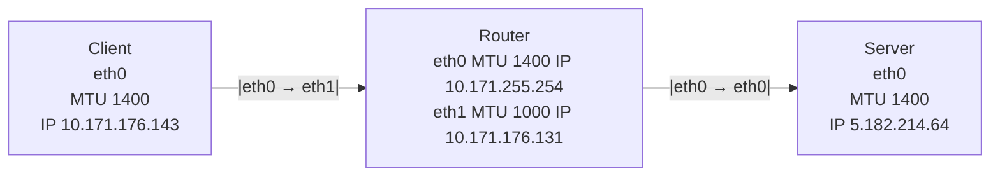

#

```mermaid
graph LR
    C["Client<br/>eth0<br/>MTU 1400<br/>IP 10.171.176.143"]
    R["Router<br/>eth0 MTU 1400 IP 10.171.255.254<br/>eth1 MTU 1000 IP 10.171.176.131"]
    S["Server<br/>eth0<br/>MTU 1400<br/>IP 5.182.214.64"]

    C --|eth0 → eth1|--> R
    R --|eth0 → eth0|--> S


```
